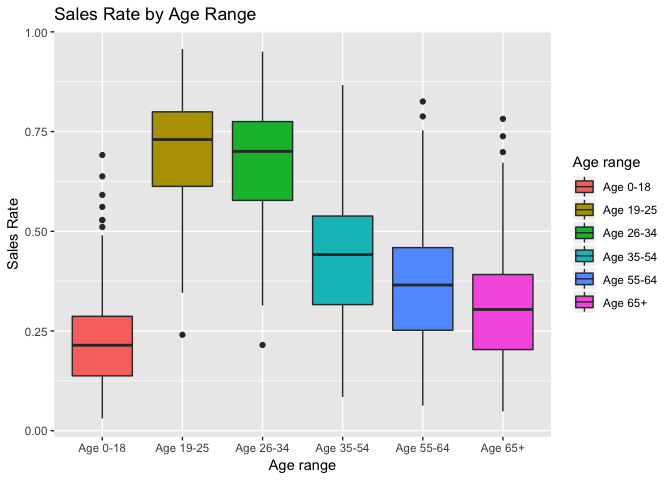
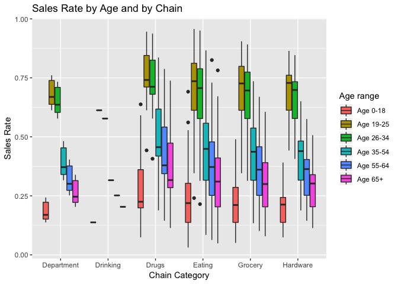
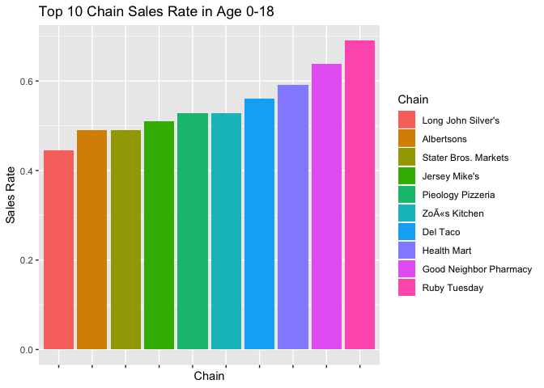
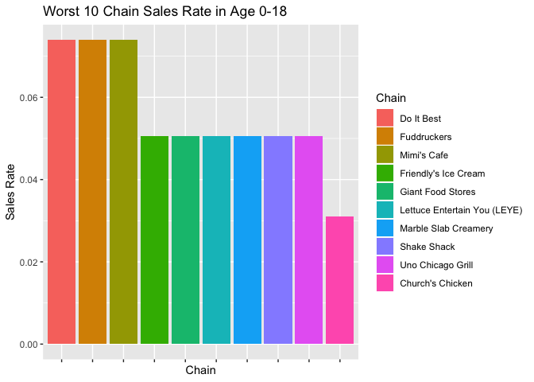
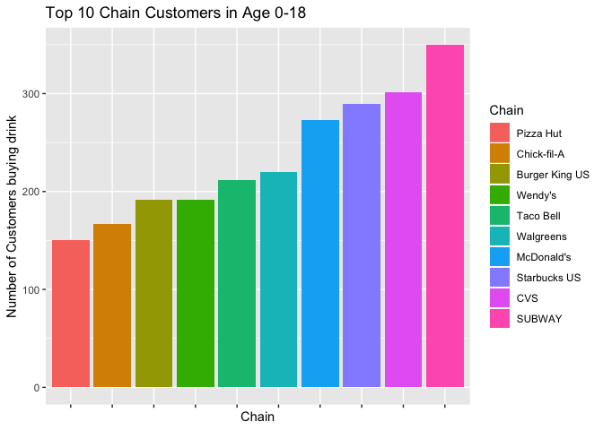
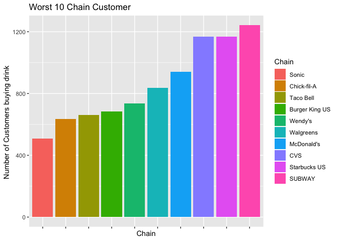

```r
library(ggplot2)
library(readxl)
library(dplyr)
```

```
## 
## Attaching package: 'dplyr'
```

```
## The following objects are masked from 'package:stats':
## 
##     filter, lag
```

```
## The following objects are masked from 'package:base':
## 
##     intersect, setdiff, setequal, union
```

```r
library(purrr)
library(tidyr)
library(car)
```

```
## Loading required package: carData
```

```
## 
## Attaching package: 'car'
```

```
## The following object is masked from 'package:purrr':
## 
##     some
```

```
## The following object is masked from 'package:dplyr':
## 
##     recode
```

```r
inMarket<- read_excel("~/Desktop/Jobs/inMarket/inMarket Data1.xlsx")
inMarket2<- read_excel("~/Desktop/Jobs/inMarket/inMarket Data2.xlsx")

#Assumptions

#To clarify and to avoid confusion of the understanding of the dataset,

#First Assumption:::::
#I assume that..

#"Non-Customers" variable is the customers who don't buy drink
#"Customers" variable is the customers who buy drink
#in both tables. 

#Second Assumption:::::
#I assume that..

#Since the client company, named Brawndo, is the "children's electrolyte drink company," I assume that the future target customer is the children, which is Age Range "0-18." 

#Another assumption in here is that this dataset doesn't depend on the fact that parents don't buy the drink for children. 


str(inMarket)
```

```
## Classes 'tbl_df', 'tbl' and 'data.frame':	268 obs. of  4 variables:
##  $ Chain         : chr  "SUBWAY" "CVS" "Starbucks US" "McDonald's" ...
##  $ Chain Category: chr  "Eating Places" "Drug Stores and Proprietary Stores" "Eating Places" "Eating Places" ...
##  $ Non-Customers : num  5131 4817 4817 3875 3456 ...
##  $ Customers     : num  5000 4302 4128 3895 3140 ...
```

```r
#Change the type of 'Chain Category' variable from character to factor variable. 
inMarket$`Chain Category`<-as.factor(inMarket$`Chain Category`)

levels(inMarket$`Chain Category`)
```

```
## [1] "Department Stores"                    
## [2] "Drinking Places (alcoholic Beverages)"
## [3] "Drug Stores and Proprietary Stores"   
## [4] "Eating Places"                        
## [5] "Grocery Stores"                       
## [6] "Hardware Stores"
```

```r
#Exploring the Customers and Non-customers variable by Chain Category
inMarket %>%
  group_by(`Chain Category`) %>%
  summarise(count=n(),
            mean=mean(Customers),
            sd=sd(Customers))
```

```
## # A tibble: 6 x 4
##   `Chain Category`                      count  mean    sd
##   <fct>                                 <int> <dbl> <dbl>
## 1 Department Stores                        11  476.  380.
## 2 Drinking Places (alcoholic Beverages)     1   58    NA 
## 3 Drug Stores and Proprietary Stores       10 1151. 1458.
## 4 Eating Places                           194  517.  745.
## 5 Grocery Stores                           45  244.  262.
## 6 Hardware Stores                           7  507.  555.
```

```r
inMarket %>%
  group_by(`Chain Category`) %>%
  summarise(count=n(),
            mean=mean(`Non-Customers`),
            sd=sd(`Non-Customers`))
```

```
## # A tibble: 6 x 4
##   `Chain Category`                      count  mean    sd
##   <fct>                                 <int> <dbl> <dbl>
## 1 Department Stores                        11  581.  464.
## 2 Drinking Places (alcoholic Beverages)     1  105    NA 
## 3 Drug Stores and Proprietary Stores       10 1120. 1699.
## 4 Eating Places                           194  488.  729.
## 5 Grocery Stores                           45  233.  213.
## 6 Hardware Stores                           7  539.  556.
```

```r
#Since the dataset has only 1 observation for "Drinking Places (alcoholic Beverages)," 
#we may not consider "Drinking Places (alcoholic Beverages)"
#Also, as the assumptions above, our future target customers are children, which is Age Range 0-18, 
#we don't have to consider this observation. 


#Manipulating the table1 to create new variables which is the following;

#the proportion of Non-Customers by Age Range
#the proportion of Customers by Age Range

#with the two variables above, 

#the proportional number of Non-Customers by Age Range and by Chain
#the proportional number of Customers by Age Range and by Chain

n<-6
inMarket3<-do.call("rbind",replicate(n,inMarket,simplify = FALSE))
inMarket3<-inMarket3[order(inMarket3$Chain),]
inMarket3$`Age range`<-c(inMarket2$`Age range`)

#The proportion of Non-Customers by Age Range
#The proportion of Customers by Age Range
p<-data.frame(p.non.by.age=prop.table(inMarket2$`Non-Customers`),
              p.by.age=prop.table(inMarket2$Customers))
p<-cbind(p,"Age range"=c(inMarket2$`Age range`))

m1<-merge(inMarket3,p,by="Age range",all=TRUE)
m1<-m1[order(m1$Chain),]

m1$p.non.customers.by.age<-m1$`Non-Customers`*m1$p.non.by.age
m1$p.customers.by.age<-m1$Customers*m1$p.by.age

m2<-m1[,-c(6:7)]

str(m2)
```

```
## 'data.frame':	1608 obs. of  7 variables:
##  $ Age range             : chr  "Age 0-18" "Age 19-25" "Age 26-34" "Age 35-54" ...
##  $ Chain                 : chr  "99 Ranch Market" "99 Ranch Market" "99 Ranch Market" "99 Ranch Market" ...
##  $ Chain Category        : Factor w/ 6 levels "Department Stores",..: 5 5 5 5 5 5 4 4 4 4 ...
##  $ Non-Customers         : num  105 105 105 105 105 105 105 105 105 105 ...
##  $ Customers             : num  174 174 174 174 174 174 233 233 233 233 ...
##  $ p.non.customers.by.age: num  25.46 9.54 12.73 27.58 13.79 ...
##  $ p.customers.by.age    : num  12.2 45.2 52.2 38.3 13.9 ...
```

```r
m2$`Age range`<-as.factor(m2$`Age range`)

#Creating new variable which is,

#The proportional number of customers by Age Range and by Customers 
#divided by the total number of customers by Age Range and by Chain

#This new variable will imply 
#the probability that the customers will buy drink by Age Range and by Chain.
#Simply, sales rate. 

m2$prop.customers.by.age.by.total<-
  m2$p.customers.by.age/(m2$p.non.customers.by.age+m2$p.customers.by.age)


#By Chain Categories in Age Range 0-18:::::::::::::

#I am going to explore the dataset and to see any business insight 
#from the graphs by Age and by Chain Categories. 

m2 %>%
  group_by(`Age range`) %>%
  summarise(mean=mean(prop.customers.by.age.by.total))
```

```
## # A tibble: 6 x 2
##   `Age range`  mean
##   <fct>       <dbl>
## 1 Age 0-18    0.229
## 2 Age 19-25   0.708
## 3 Age 26-34   0.679
## 4 Age 35-54   0.441
## 5 Age 55-64   0.372
## 6 Age 65+     0.315
```

```r
#The average sales rate in age 0-18 is 0.229, 22.9%.

#The highest average sales rate is age 19-25, which is 0.708, 70.8%. 

m2 %>%
  group_by(`Chain Category`) %>%
  summarise(mean=mean(prop.customers.by.age.by.total))
```

```
## # A tibble: 6 x 2
##   `Chain Category`                       mean
##   <fct>                                 <dbl>
## 1 Department Stores                     0.418
## 2 Drinking Places (alcoholic Beverages) 0.350
## 3 Drug Stores and Proprietary Stores    0.517
## 4 Eating Places                         0.457
## 5 Grocery Stores                        0.460
## 6 Hardware Stores                       0.430
```

```r
#The average sales rate in "Drug Stores and Proprietary Stores" is the highest, which is 0.517, 51.7%. 


#Boxplot for the sales rate by Age Range
ggplot(data=m2,aes(x=`Age range`,
                   y=prop.customers.by.age.by.total,
                   fill=`Age range`))+
  geom_boxplot()+
  labs(title="Sales Rate by Age Range",
       y="Sales Rate")
```

<!-- -->

```r
#As we can see, 
#The overall sasles rate in age 0-18 is the lowest among the all Age Range. 

#The overall sales rate in age 19-25 is the highset sales rate. 


#Boxplot for the sales rate by Age Range and by Chain Categories
m2 %>%
  group_by(`Chain Category`,`Age range`) %>%
  ggplot(aes(x=`Chain Category`,
             y=prop.customers.by.age.by.total, 
             fill=`Age range`))+
  geom_boxplot()+
  scale_x_discrete(labels=c("Department","Drinking","Drugs","Eating","Grocery","Hardware"))+
  labs(title="Sales Rate by Age and by Chain",
       y="Sales Rate")
```

<!-- -->

```r
#As mentioned above, the lowest overall sales rate in age range is age 0-18.


#Boxplot for Sales Rate in age 0-18
m2[which(m2$`Age range`=="Age 0-18"),] %>%
  group_by(`Chain Category`) %>%
  ggplot(aes(x=`Chain Category`,
             y=prop.customers.by.age.by.total,
             fill=`Chain Category`))+
  geom_boxplot()+
  theme(axis.text.x =element_blank())+
  labs(title="Sales Rate by Chain Categories in Age Range 0-18",
       y="Sales Rate")
```

<!-- -->

```r
#For the target customer is Age Range 0-18, 
#The Chain Category that has the highest sales rate is "Drug Stores and Proprietary Stores."

#"Department Stores" has the lowest sales rate except for "Drinking Places (alcoholic Beverages)" as the assumption above. 


#Top 10 and worst 10 chain that the customers buying drink in Age 0-18:::::::::

#I am going to investigate top 10 and worst 10 with the probability of customers who buy drink in Age 0-18.

#It will provide the information of the Chain that have top 10 sales rate and worst 10 sales rate regardless of the amount of sales. 

#1. Top 10 and Worst 10 with the sales rate in Age 0-18

m3<-m2[which(m2$`Age range`=="Age 0-18"),]

#Top 10 Chain sales rate in age 0-18 

top10.prob<-data.frame(head(m3[order(m3$prop.customers.by.age.by.total,decreasing = TRUE),],10))

#Plot for top 10 sales rate
ggplot(data=top10.prob, aes(x=reorder(Chain,prop.customers.by.age.by.total),
                    y=prop.customers.by.age.by.total,
                    fill=reorder(Chain,prop.customers.by.age.by.total)))+
  geom_bar(stat="identity")+
  theme(axis.text.x = element_blank())+
  labs(title="Top 10 Chain Sales Rate in Age 0-18", 
       x="Chain",
       y="Sales Rate")+
  guides(fill=guide_legend(title="Chain"))
```

<!-- -->

```r
#Creating a dataset for Top 10 chain sales rate in age 0-18
top10.chain.prob<-
  data.frame(Chain=top10.prob$Chain[order(top10.prob$prop.customers.by.age.by.total,decreasing=TRUE)],
             p.customer=
               paste0(round(top10.prob$prop.customers.by.age.by.total[order(top10.prob$prop.customers.by.age.by.total,
                                                             decreasing=TRUE)]*100,digits = 2)," %"),
             t.customer=round(top10.prob$p.customers.by.age+top10.prob$p.non.customers.by.age,2))


colnames(top10.chain.prob)<-c("Chain",
                         "Sales Rate",
                         "The total number of customers")

top10.chain.prob
```

```
##                     Chain Sales Rate The total number of customers
## 1            Ruby Tuesday    69.13 %                         82.45
## 2  Good Neighbor Pharmacy    63.77 %                         70.27
## 3             Health Mart    59.13 %                        123.98
## 4                Del Taco    56.12 %                         58.02
## 5       Pieology Pizzeria    52.82 %                         53.96
## 6           Zoës Kitchen    52.82 %                         53.96
## 7           Jersey Mike's    51.09 %                        103.61
## 8              Albertsons    48.98 %                         49.89
## 9    Stater Bros. Markets    48.98 %                         49.89
## 10     Long John Silver's    44.53 %                         91.35
```

```r
#Worst 10 Chain sales rate in age 0-18

worst10.prob<-data.frame(head(m3[order(m3$prop.customers.by.age.by.total,decreasing = FALSE),],10))

#Plot for worst 10
ggplot(data=worst10.prob, aes(x=reorder(Chain,-prop.customers.by.age.by.total),
                         y=prop.customers.by.age.by.total,
                         fill=reorder(Chain,-prop.customers.by.age.by.total)))+
  geom_bar(stat="identity")+
  theme(axis.text.x = element_blank())+
  labs(title="Worst 10 Chain Sales Rate in Age 0-18", 
       x="Chain",
       y="Sales Rate")+
  guides(fill=guide_legend(title="Chain"))
```

<!-- -->

```r
#The worst 10 chains have several same sales rate, since they have the same number of customers buying drink. 


#Creating a dataset for Worst 10 chain sales rate in age 0-18
worst10.chain.prob<-
  data.frame(Chain=worst10.prob$Chain[order(worst10.prob$prop.customers.by.age.by.total)],
             n.customer=
              paste0(round(worst10.prob$prop.customers.by.age.by.total[order(worst10.prob$prop.customers.by.age.by.total, decreasing=FALSE)]*100,digits=2)," %"),
             t.customer=round(worst10.prob$p.customers.by.age+worst10.prob$p.non.customers.by.age,2))


colnames(worst10.chain.prob)<-c("Chain","Sales Rate", "The total number of customers")

top10.chain.prob
```

```
##                     Chain Sales Rate The total number of customers
## 1            Ruby Tuesday    69.13 %                         82.45
## 2  Good Neighbor Pharmacy    63.77 %                         70.27
## 3             Health Mart    59.13 %                        123.98
## 4                Del Taco    56.12 %                         58.02
## 5       Pieology Pizzeria    52.82 %                         53.96
## 6           Zoës Kitchen    52.82 %                         53.96
## 7           Jersey Mike's    51.09 %                        103.61
## 8              Albertsons    48.98 %                         49.89
## 9    Stater Bros. Markets    48.98 %                         49.89
## 10     Long John Silver's    44.53 %                         91.35
```

```r
worst10.chain.prob
```

```
##                           Chain Sales Rate The total number of customers
## 1              Church's Chicken      3.1 %                        131.10
## 2          Friendly's Ice Cream     5.06 %                         80.19
## 3             Giant Food Stores     5.06 %                         80.19
## 4  Lettuce Entertain You (LEYE)     5.06 %                         80.19
## 5          Marble Slab Creamery     5.06 %                         80.19
## 6                   Shake Shack     5.06 %                         80.19
## 7             Uno Chicago Grill     5.06 %                         80.19
## 8                    Do It Best      7.4 %                        109.71
## 9                   Fuddruckers      7.4 %                        109.71
## 10                  Mimi's Cafe      7.4 %                        109.71
```

```r
#Top 10 and Worst 10 for the sales rate in age 0-18

#Even though the number of customers is relatively low as the tables show, it would be better to focus on top 10 chain for sales rate to increase overall sales rate.


#2. Top 10 and Worst 10 for the number of customers buying drink in Age 0-18

top10.num<-data.frame(head(m3[order(m3$p.customers.by.age,decreasing = TRUE),],10))

#Plot for top 10
ggplot(data=top10.num, aes(x=reorder(Chain,p.customers.by.age),
                    y=p.customers.by.age,
                    fill=reorder(Chain,p.customers.by.age)))+
  geom_bar(stat="identity")+
  theme(axis.text.x = element_blank())+
  labs(title="Top 10 Chain Customers in Age 0-18", 
       x="Chain",
       y="Number of Customers buying drink")+
  guides(fill=guide_legend(title="Chain"))
```

<!-- -->

```r
#Top 10 chain for the number of the customers buying drink in age 0-18

top10.chain.num<-
  data.frame(Chain=top10.num$Chain[order(top10.num$p.customers.by.age,decreasing=TRUE)],
             n.customer=
               round(top10.num$p.customers.by.age[order(top10.num$p.customers.by.age,decreasing=TRUE)]),
             p.customer=paste0(round(top10.num$prop.customers.by.age.by.total*100,2),"%"))


colnames(top10.chain.num)<-c("Chain",
                         "The number of customers",
                         "Sales Rate")

top10.chain.num
```

```
##             Chain The number of customers Sales Rate
## 1          SUBWAY                     350     21.96%
## 2             CVS                     301      20.5%
## 3    Starbucks US                     289     19.84%
## 4      McDonald's                     273      22.5%
## 5       Walgreens                     220     20.79%
## 6       Taco Bell                     212     24.28%
## 7  Burger King US                     191     21.83%
## 8         Wendy's                     191     20.63%
## 9     Chick-fil-A                     167     20.82%
## 10      Pizza Hut                     151     33.08%
```

```r
#Worst 10 Chain for the number of customers buying drink in age 0-18

worst10.num<-data.frame(head(m3[order(m3$p.non.customers.by.age,decreasing = TRUE),],10))
#Plot for worst 10
ggplot(data=worst10.num, aes(x=reorder(Chain,p.non.customers.by.age),
                         y=p.non.customers.by.age,
                         fill=reorder(Chain,p.non.customers.by.age)))+
  geom_bar(stat="identity")+
  theme(axis.text.x = element_blank())+
  labs(title="Worst 10 Chain Customer", 
       x="Chain",
       y="Number of Customers buying drink ")+
  guides(fill=guide_legend(title="Chain"))
```

<!-- -->

```r
#The worst 10 chains have the same number of customer buying drink in Age 0-18


#Worst 10 chain that customers buy drink in Age Range 0-18
worst10.chain.num<-
  data.frame(Chain=worst10.num$Chain[order(worst10.num$p.non.customers.by.age,decreasing = TRUE)],
             n.customer=
              worst10.num$p.non.customers.by.age,
             p.customer=
               paste0(
                 round(worst10.num$prop.customers.by.age.by.total*100,digits=2), "%"))

colnames(worst10.chain.num)<-c("Chain","The number of Non-customers", "Sales Rate")

top10.chain.num
```

```
##             Chain The number of customers Sales Rate
## 1          SUBWAY                     350     21.96%
## 2             CVS                     301      20.5%
## 3    Starbucks US                     289     19.84%
## 4      McDonald's                     273      22.5%
## 5       Walgreens                     220     20.79%
## 6       Taco Bell                     212     24.28%
## 7  Burger King US                     191     21.83%
## 8         Wendy's                     191     20.63%
## 9     Chick-fil-A                     167     20.82%
## 10      Pizza Hut                     151     33.08%
```

```r
worst10.chain.num
```

```
##             Chain The number of Non-customers Sales Rate
## 1          SUBWAY                   1243.9913     21.96%
## 2             CVS                   1167.8632      20.5%
## 3    Starbucks US                   1167.8632     19.84%
## 4      McDonald's                    939.4789      22.5%
## 5       Walgreens                    837.8940     20.79%
## 6         Wendy's                    736.3090     20.63%
## 7  Burger King US                    685.3953     21.83%
## 8       Taco Bell                    660.1809     24.28%
## 9     Chick-fil-A                    634.7241     20.82%
## 10          Sonic                    507.6823     19.91%
```

```r
#Top 10 and Worst 10 for the number of customers buying drink in age 0-18

#We can notice that the Chains of Top 10 and Worst 10 for the number of customers are differenet with the Chains of Top 10 and Worst 10 for the sales rate. 

#We also can notice that some Chain are in the top 10 and worst 10 for the number of customers, such as Subway, CVS, Starbucks US, McDonald's, Walgreens, Taco Bell, Burger King US, or Chick-fill-A.

#This result is from the fact that those chains have the most number of customers. 
#Therefore, regardsless of sales rate, since they have the most number of customers, they are accounting for top 10 and worst 10. 

#This insight will be helpful to increase the sales volume. 
```
